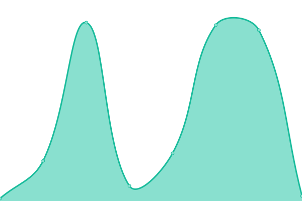

# [📈 Live Status](https://status.blurry.gay): <!--live status--> **🟩 All systems operational**

This repository contains the open-source uptime monitor and status page for [blryface](https://blurry.gay), powered by [Upptime](https://github.com/upptime/upptime).

With [Upptime](https://upptime.js.org), you can get your own unlimited and free uptime monitor and status page, powered entirely by a GitHub repository. We use [Issues](https://github.com/blryface/uptime/issues) as incident reports, [Actions](https://github.com/blryface/uptime/actions) as uptime monitors, and [Pages](https://status.blurry.gay) for the status page.

<!--start: status pages-->
<!-- This summary is generated by Upptime (https://github.com/upptime/upptime) -->
<!-- Do not edit this manually, your changes will be overwritten -->
<!-- prettier-ignore -->
| URL | Status | History | Response Time | Uptime |
| --- | ------ | ------- | ------------- | ------ |
|  [Notessential](https://notessential.blurry.gay) | 🟩 Up | [notessential.yml](https://github.com/blryface/uptime/commits/HEAD/history/notessential.yml) | 

 572ms
     
 | 

<a href="https://status.blurry.gay/history/notessential">100.00%</a>
    

|  [CRSS Website](https://crss.cc) | 🟩 Up | [crss-website.yml](https://github.com/blryface/uptime/commits/HEAD/history/crss-website.yml) | 

 391ms
     
 | 

<a href="https://status.blurry.gay/history/crss-website">100.00%</a>
    

|  [Pridecraft Website](https://pridecraft.gay) | 🟩 Up | [pridecraft-website.yml](https://github.com/blryface/uptime/commits/HEAD/history/pridecraft-website.yml) | 

 325ms
     
 | 

<a href="https://status.blurry.gay/history/pridecraft-website">100.00%</a>
    

|  [CRSS Server (Proxy)](132.145.233.75) | 🟩 Up | [crss-server-proxy.yml](https://github.com/blryface/uptime/commits/HEAD/history/crss-server-proxy.yml) | 

 122ms
     
 | 

<a href="https://status.blurry.gay/history/crss-server-proxy">100.00%</a>
    

|  [CRSS Server (SMP)](map.crss.cc) | 🟩 Up | [crss-server-smp.yml](https://github.com/blryface/uptime/commits/HEAD/history/crss-server-smp.yml) | 

 468ms
     
 | 

<a href="https://status.blurry.gay/history/crss-server-smp">100.00%</a>
    

|  [CRSS2 Server](150.136.43.197) | 🟩 Up | [crss-2-server.yml](https://github.com/blryface/uptime/commits/HEAD/history/crss-2-server.yml) | 

 32ms
     
 | 

<a href="https://status.blurry.gay/history/crss-2-server">100.00%</a>
    

<!--end: status pages-->

[**Visit our status website →**](https://status.blurry.gay)

## 📄 License

- Powered by: [Upptime](https://github.com/upptime/upptime)
- Code: [MIT](./LICENSE) © [Anand Chowdhary](https://anandchowdhary.com), supported by [Pabio](https://pabio.com)
- Data in the `./history` directory: [Open Database License](https://opendatacommons.org/licenses/odbl/1-0/)
